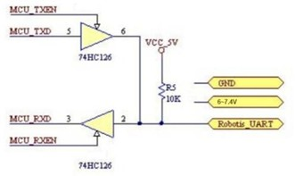

# Hiwonder Bus Servo Communication Protocol
***Cleaned and edited by robonxt, formatted by Claude 3.7***

***Last updated: 2025-07-10***

## 1. Summary
The Hiwonder Bus Servo system utilizes an asynchronous serial bus communication protocol that enables daisy-chaining of up to 253 servos, each with a unique node address. This architecture allows for both unified and independent control through standard UART interfaces. The system communicates with host controllers (microcontrollers or PCs) via asynchronous serial communication, providing comprehensive parameter configuration and function control.

Servos can operate in two primary modes:
- **Motor Control Mode**: Functions as a DC reduction motor with adjustable speed control
- **Position Control Mode**: Offers precise positioning within a 0-240° rotation range with an additional ±30° adjustable deviation range

The half-duplex UART interface (115200bps) implements a simplified protocol that enables versatile servo control while maintaining straightforward integration requirements.

## 2. UART Interface Specifications

### Communication Parameters
- **Interface Type**: Half-duplex asynchronous serial (UART)
- **Baud Rate**: 115200 bps
- **Data Bits**: 8
- **Stop Bits**: 1
- **Parity**: None
- **Flow Control**: None

### Implementation Notes
- The servo uses software-based timing control for the UART interface
- Multiple servos can be connected in a daisy-chain configuration
- A single control line is used for both transmission and reception
- When implementing a controller, ensure proper handling of the half-duplex nature of the bus

### Connection Diagram

## 3. Command Packet Structure

### Table 1: Command Packet Format

| Field       | Size (bytes) | Description                               |
|-------------|-------------|--------------------------------------------|  
| Header      | 2           | Fixed value: 0x55 0x55                     |
| ID          | 1           | Servo ID (0-253) or Broadcast ID (254)     |
| Length      | 1           | Data length (Command + Parameters)         |
| Command     | 1           | Instruction code                           |
| Parameters  | 0-N         | Command-specific parameters                |
| Checksum    | 1           | Error detection value                      |

### Field Descriptions

#### Header
- Two consecutive bytes with value 0x55 (85 decimal)
- Marks the beginning of a valid command packet

#### ID
- **Range**: 0-253 (0x00-0xFD in hexadecimal)
- Uniquely identifies which servo should respond to the command
- **Broadcast ID**: 254 (0xFE)
  - When used, all connected servos will receive and execute the command
  - No servo will send a response (prevents bus conflicts)
  - Exception: ID read commands will receive responses even with broadcast ID

#### Length
- Specifies the total length in bytes of the Command and Parameters fields combined
- Total packet length = Length + 3 bytes (Header[2] + ID[1])

#### Command
- Specifies the operation to be performed by the servo
- See Command Types section for available commands

#### Parameters
- Command-specific data values
- Number and meaning vary based on the command type
- Parameters are typically 1 byte each

#### Checksum
- Used for error detection to ensure data integrity
- **Calculation Formula**:  
  `Checksum = ~(ID + Length + Cmd + Prm1 + ... + PrmN)`
- If the sum exceeds 255 (0xFF), only the lowest byte is used
- `~` represents the bitwise NOT operation (one's complement)

## 4. Command Types

The protocol supports two categories of commands:

### Write Commands
- Include parameters to configure servo settings or trigger actions
- Write values to the servo's internal registers
- Example naming convention: SERVO_*_WRITE

### Read Commands
- Typically have no parameters in the request
- Trigger an immediate response from the servo
- Response contains the requested data with matching command value
- Host must switch to receive mode immediately after sending
- Example naming convention: SERVO_*_READ

The following table lists all available commands that can be sent from the host controller to servos:

### Table 2: Command Types

| Command Name | Value | Length |
|-------------|-------|--------|
| SERVO_MOVE_TIME_WRITE | 1 | 7 |
| SERVO_MOVE_TIME_READ | 2 | 3 |
| SERVO_MOVE_TIME_WAIT_WRITE | 7 | 7 |
| SERVO_MOVE_TIME_WAIT_READ | 8 | 3 |
| SERVO_MOVE_START | 11 | 3 |
| SERVO_MOVE_STOP | 12 | 3 |
| SERVO_ID_WRITE | 13 | 4 |
| SERVO_ID_READ | 14 | 3 |
| SERVO_ANGLE_OFFSET_ADJUST | 17 | 4 |
| SERVO_ANGLE_OFFSET_WRITE | 18 | 3 |
| SERVO_ANGLE_OFFSET_READ | 19 | 3 |
| SERVO_ANGLE_LIMIT_WRITE | 20 | 7 |
| SERVO_ANGLE_LIMIT_READ | 21 | 3 |
| SERVO_VIN_LIMIT_WRITE | 22 | 7 |
| SERVO_VIN_LIMIT_READ | 23 | 3 |
| SERVO_TEMP_MAX_LIMIT_WRITE | 24 | 4 |
| SERVO_TEMP_MAX_LIMIT_READ | 25 | 3 |
| SERVO_TEMP_READ | 26 | 3 |
| SERVO_VIN_READ | 27 | 3 |
| SERVO_POS_READ | 28 | 3 |
| SERVO_OR_MOTOR_MODE_WRITE | 29 | 7 |
| SERVO_OR_MOTOR_MODE_READ | 30 | 3 |
| SERVO_LOAD_OR_UNLOAD_WRITE | 31 | 4 |
| SERVO_LOAD_OR_UNLOAD_READ | 32 | 3 |
| SERVO_LED_CTRL_WRITE | 33 | 4 |
| SERVO_LED_CTRL_READ | 34 | 3 |
| SERVO_LED_ERROR_WRITE | 35 | 4 |
| SERVO_LED_ERROR_READ | 36 | 3 |

**Notes:**
- Command name: Just for easy identification. The suffix "_WRITE" represents write commands, and "_READ" represents read commands.
- Command value: The command byte in the command packet (see Table 1).
- Length: The data length field value in the command packet.

### Command Details

#### 1. SERVO_MOVE_TIME_WRITE

| Parameter | Description |
| --- | --- |
| 1 | Lower 8 bits of angle value |
| 2 | Higher 8 bits of angle value. Range 0~1000, corresponding to servo angle of 0~240°. Minimum angle increment is 0.24 degree. |
| 3 | Lower 8 bits of time value |
| 4 | Higher 8 bits of time value. Range 0~30000ms. When command is sent, servo rotates from current angle to target angle at uniform speed within specified time. Rotation begins immediately. |

#### 2. SERVO_MOVE_TIME_READ

Reads the angle and time values previously sent by SERVO_MOVE_TIME_WRITE.

For details of the response packet, refer to Table 4 below.

#### 3. SERVO_MOVE_TIME_WAIT_WRITE

| Parameter | Description |
| --- | --- |
| 1 | Lower 8 bits of preset angle |
| 2 | Higher 8 bits of preset angle. Range 0~1000, corresponding to servo angle of 0~240°. Minimum angle increment is 0.24 degree. |
| 3 | Lower 8 bits of preset time |
| 4 | Higher 8 bits of preset time. Range 0~30000ms. |

Similar to SERVO_MOVE_TIME_WRITE but the servo will not immediately rotate when the command arrives. The servo will only begin rotation when a SERVO_MOVE_START command (value 11) is received.

#### 4. SERVO_MOVE_TIME_WAIT_READ

Reads the preset angle and time values previously sent by SERVO_MOVE_TIME_WAIT_WRITE.

For details of the response packet, refer to Table 3 below.

#### 5. SERVO_MOVE_START

Triggers execution of commands previously set with SERVO_MOVE_TIME_WAIT_WRITE.

#### 6. SERVO_MOVE_STOP

When this command arrives at the servo, it will stop running immediately if rotating, and maintain the current angle position.

#### 7. SERVO_ID_WRITE

| Parameter | Description |
| --- | --- |
| 1 | The servo ID, range 0~253, defaults to 1. This command rewrites the ID value to the servo and saves it even when powered down. |

#### 8. SERVO_ID_READ

Reads the servo ID. For details of the response packet, refer to Table 4 below.

#### 9. SERVO_ANGLE_OFFSET_ADJUST

| Parameter | Description |
| --- | --- |
| 1 | Servo deviation, range -125~125, corresponding to angle of -30°~30°. When this command reaches the servo, it immediately rotates to adjust the deviation. |

**Notes:**
- The adjusted deviation value is not saved when powered down. To save permanently, use SERVO_ANGLE_OFFSET_WRITE (command 18).
- Parameter is "signed char" type but command packets use "unsigned char", so parameters must be converted before sending.

#### 10. SERVO_ANGLE_OFFSET_WRITE

Saves the deviation value with power-down persistence. The adjustment of the deviation is as described in command 9.

#### 11. SERVO_ANGLE_OFFSET_READ

Reads the deviation value set in the servo. For details of the response packet, refer to Table 4 below.

#### 12. SERVO_ANGLE_LIMIT_WRITE

| Parameter | Description |
| --- | --- |
| 1 | Lower 8 bits of minimum angle |
| 2 | Higher 8 bits of minimum angle, range 0~1000 |
| 3 | Lower 8 bits of maximum angle |
| 4 | Higher 8 bits of maximum angle, range 0~1000 |

The minimum angle value must be less than the maximum angle value. This command limits the servo's rotation angle between the minimum and maximum values. The angle limit values persist through power cycles.

#### 13. SERVO_ANGLE_LIMIT_READ

Reads the angle limit values of the servo. For details of the response packet, refer to Table 4 below.

#### 14. SERVO_VIN_LIMIT_WRITE

| Parameter | Description |
| --- | --- |
| 1 | Lower 8 bits of minimum input voltage |
| 2 | Higher 8 bits of minimum input voltage, range 4500~12000mV |
| 3 | Lower 8 bits of maximum input voltage |
| 4 | Higher 8 bits of maximum input voltage, range 4500~12000mV |

The minimum input voltage must be less than the maximum input voltage. If the servo's input voltage goes outside this range, the LED will flash (if LED alarm is set) and the motor will be unloaded (no torque output) to protect the servo. The voltage limit values persist through power cycles.

#### 15. SERVO_VIN_LIMIT_READ

Reads the voltage limit values of the servo. For details of the response packet, refer to Table 4 below.

#### 16. SERVO_TEMP_MAX_LIMIT_WRITE

| Parameter | Description |
| --- | --- |
| 1 | Maximum temperature limit, range 50~100°C. If the temperature inside the servo exceeds this limit, the LED will flash (if LED alarm is set) and the motor will be unloaded (no torque output) to protect the servo. This value persists through power cycles. |

#### 17. SERVO_TEMP_MAX_LIMIT_READ

Reads the maximum temperature limit value. For details of the response packet, refer to Table 4 below.

#### 18. SERVO_TEMP_READ

Reads the real-time temperature inside the servo. For details of the response packet, refer to Table 4 below.

#### 19. SERVO_VIN_READ

Reads the current input voltage of the servo. For details of the response packet, refer to Table 4 below.

#### 20. SERVO_POS_READ

Reads the current angle position of the servo. For details of the response packet, refer to Table 4 below.

#### 21. SERVO_OR_MOTOR_MODE_WRITE

| Parameter | Description |
| --- | --- |
| 1 | Servo mode: 0 = position control mode, 1 = motor control mode (default: 0) |
| 2 | Null value (not used) |
| 3 | Lower 8 bits of rotation speed value |
| 4 | Higher 8 bits of rotation speed value. Range -1000~1000, only valid in motor control mode. Negative values = reverse rotation, positive values = forward rotation. Mode and speed settings do not persist through power cycles. |

**Note**: Since rotation speed is "signed short int" type, it must be converted to "unsigned short int" type before sending in the command packet.

#### 22. SERVO_OR_MOTOR_MODE_READ

Reads the current mode and speed values of the servo. For details of the response packet, refer to Table 4 below.

#### 23. SERVO_LOAD_OR_UNLOAD_WRITE

| Parameter | Description |
| --- | --- |
| 1 | Motor load status: 0 = unloaded (no torque output), 1 = loaded (has torque output). Default is 0. |

#### 24. SERVO_LOAD_OR_UNLOAD_READ

Reads the load state of the internal motor of the servo. For details of the response packet, refer to Table 4 below.

#### 25. SERVO_LED_CTRL_WRITE

| Parameter | Description |
| --- | --- |
| 1 | LED state: 0 = LED always on (default), 1 = LED off. This setting persists through power cycles. |

#### 26. SERVO_LED_CTRL_READ

Reads the current LED state setting. For details of the response packet, refer to Table 4 below.

#### 27. SERVO_LED_ERROR_WRITE

| Parameter | Description |
| --- | --- |
| 1 | Fault alarm configuration, range 0~7. Determines which fault conditions will trigger LED flashing alarms. |

**Note**: There are three types of faults that can cause the LED to flash as an alarm, regardless of the LED on/off state:
1. Internal temperature exceeds the maximum temperature limit (set by command 16)
2. Input voltage exceeds the limit values (set by command 14)
3. Locked-rotor condition

The parameter value corresponds to the fault alarm relationship as shown in Table 3 below:

### Table 3: Fault alarm relationship
| Code | Description |
| --- | --- |
| 0 | No alarm |
| 1 | Over temperature |
| 2 | Over voltage |
| 3 | Over temperature and over voltage |
| 4 | Locked-rotor |
| 5 | Over temperature and stalled |
| 6 | Over voltage and stalled |
| 7 | Over temperature, over voltage and stalled |

#### 28. SERVO_LED_ERROR_READ

Reads the current fault alarm configuration. For details of the response packet, refer to Table 4 below.

### Table 4: Servo Response Packets
| Command name	| Command value	| Length |
| --- | --- | --- |
| SERVO_MOVE_TIME_READ	    | 2	    | 7 |
| SERVO_MOVE_TIME_WAIT_READ	| 8	    | 7 |
| SERVO_ID_READ	            | 14	| 4 |
| SERVO_ANGLE_OFFSET_READ	| 19	| 4 |
| SERVO_ANGLE_LIMIT_READ	| 21	| 7 |
| SERVO_VIN_LIMIT_READ	    | 23	| 7 |
| SERVO_TEMP_MAX_LIMIT_READ	| 25	| 4 |
| SERVO_TEMP_READ	        | 26	| 4 |
| SERVO_VIN_READ	        | 27	| 5 |
| SERVO_POS_READ	        | 28	| 5 |
| SERVO_OR_MOTOR_MODE_READ	| 30	| 7 |
| SERVO_LOAD_OR_UNLOAD_READ	| 32	| 4 |
| SERVO_LED_CTRL_READ	    | 34	| 4 |
| SERVO_LED_ERROR_READ	    | 36	| 4 |

Table 4 lists the response packets sent by the servo to the host computer. These responses are only sent when the host computer sends a read command to the servo. The returned command value matches the read command that was sent, but the response includes parameters containing the requested data. The format of the response packet follows the same structure as the command packet described in Table 1.

#### Response 1: SERVO_MOVE_TIME_READ

| Parameter | Description |
| --- | --- |
| 1 | Lower 8 bits of angle value |
| 2 | Higher 8 bits of angle value, range 0~1000 |
| 3 | Lower 8 bits of time value |
| 4 | Higher 8 bits of time value, range 0~30000ms |

#### Response 2: SERVO_MOVE_TIME_WAIT_READ

| Parameter | Description |
| --- | --- |
| 1 | Lower 8 bits of preset angle value |
| 2 | Higher 8 bits of preset angle value, range 0~1000 |
| 3 | Lower 8 bits of preset time value |
| 4 | Higher 8 bits of preset time value, range 0~30000ms |

#### Response 3: SERVO_ID_READ

| Parameter | Description |
| --- | --- |
| 1 | Servo ID value, default is 1 |

**Note**: ID read is special compared to other read commands. If the command packet ID is broadcast ID (254 or 0xFE), the servo will return response information. Other read commands will not return response messages when using the broadcast ID. This design allows querying a servo's ID without knowing its ID number, but requires that only one servo be on the bus to avoid data collision.

#### Response 4: SERVO_ANGLE_OFFSET_READ

| Parameter | Description |
| --- | --- |
| 1 | Deviation value set in the servo, range -125~125, default is 0 |

#### Response 5: SERVO_ANGLE_LIMIT_READ

| Parameter | Description |
| --- | --- |
| 1 | Lower 8 bits of minimum angle value |
| 2 | Higher 8 bits of minimum angle value, range 0~1000 |
| 3 | Lower 8 bits of maximum angle value |
| 4 | Higher 8 bits of maximum angle value, range 0~1000, default is 0, maximum angle is 1000 |

#### Response 6: SERVO_VIN_LIMIT_READ

| Parameter | Description |
| --- | --- |
| 1 | Lower 8 bits of input voltage value |
| 2 | Higher 8 bits of input voltage value, range 6500~10000mV |
| 3 | Lower 8 bits of maximum input voltage value |
| 4 | Higher 8 bits of maximum input voltage value, range 6500~12000mV, default is 6500V, maximum voltage is 12000mV |

#### Response 7: SERVO_TEMP_MAX_LIMIT_READ

| Parameter | Description |
| --- | --- |
| 1 | Maximum temperature limit inside the servo, range 50~100°C, default is 85°C |

#### Response 8: SERVO_TEMP_READ

| Parameter | Description |
| --- | --- |
| 1 | Current temperature inside the servo (no default value) |

#### Response 9: SERVO_VIN_READ

| Parameter | Description |
| --- | --- |
| 1 | Lower 8 bits of current input voltage value |
| 2 | Higher 8 bits of current input voltage value (no default value) |

#### Response 10: SERVO_POS_READ

| Parameter | Description |
| --- | --- |
| 1 | Lower 8 bits of current servo position value |
| 2 | Higher 8 bits of current servo position value (no default value) |

**Note**: The returned angular position value needs to be converted to "signed short int" type, as the read angle may be negative.

#### Response 11: SERVO_OR_MOTOR_MODE_READ

| Parameter | Description |
| --- | --- |
| 1 | Current mode of the servo: 0 = position control mode (default), 1 = motor control mode |
| 2 | Null value (set to 0) |
| 3 | Lower 8 bits of rotation speed value |
| 4 | Higher 8 bits of rotation speed value, range -1000~1000. Only valid in motor control mode. Negative values = reverse rotation, positive values = forward rotation. |

#### Response 12: SERVO_LOAD_OR_UNLOAD_READ

| Parameter | Description |
| --- | --- |
| 1 | Current load state of the internal motor: 0 = unloaded (no torque output), 1 = loaded (has torque output). Default is 0. |

#### Response 13: SERVO_LED_CTRL_READ

| Parameter | Description |
| --- | --- |
| 1 | LED state: 0 = LED always on (default), 1 = LED off |

#### Response 14: SERVO_LED_ERROR_READ

| Parameter | Description |
| --- | --- |
| 1 | Current fault alarm configuration, range 0~7. The corresponding relationship between values and fault conditions is shown in Table 3. |
